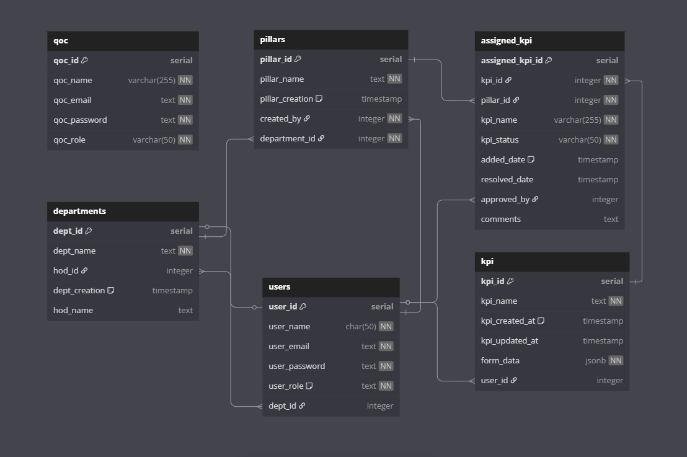

# ERP-SYS

A modern Enterprise Resource Planning (ERP) system built with **Next.js**, featuring a **monorepo structure** powered by **Turborepo**. This project includes a frontend application, a backend API server, and shared packages for UI components and database access.

## What it should do at the end
We Currently have 4 portals with 2 planned. The current portals are:
- **QOAC Portal**: For QOAC Team to assign KPIs to departments and review submissions.
- **HOD Portal**: For Heads of Departments to review and manage their KPIs.
- **Faculty Portal**: For faculty coordinators and members to fill out assigned KPIs.
- **Developer team Portal**: Postman replacement (TBA).

Future portals include (TBD):
- **Admin Portal**: For administrators to manage the entire system, including user roles and permissions.
- **Student Portal**: For students as a direct replacement to slcm.

### QOAC
* Qoac Dashboard should contain the following:
  * Dashboard showing analytics (currently showing all submissions which is inefficient)
  * Navbar with profile and search bar for searching submissions, etc.
  * Sidebar with links to:
    * KPI Builder (Currently build kpi rename it please)
    * Assign KPI (Rename to Assign KPI to Department)
    * Review KPI (Rename to Review Submissions)
    * Generate Report
    * Settings
* Pages:
  * KPI Builder (Currently build kpi rename it please) (We are creating templates here) 
  **Note**: This page will interact with the `kpi`, `pillars` table in the database. And it will interact with the api's defined under `apps/server/src/routes/kpi.ts`, `apps/server/src/routes/kpi.ts`.
    * It will have the following components:
        * KPI Builder (Kpi will be assigned to pillars in this stage):
          1. Create or select pillar component
          2. On creation or selection of pillar component, it will show the following:
             * Existing KPI Metadata (with button to view/edit/delete)
             * Create KPI button
  * Assign KPI (Rename Title of page to Asssign KPI and pillars to departments):
  **Note**: This page will interact with the `kpi`, `department`, `pillars` and `assigned_kpi` tables in the database. And it will interact with the api's defined under `apps/server/src/routes/kpi.ts` and `apps/server/src/routes/department.ts`.
    * Department Selector only at load
    * On selection of department, it will show the following:
      * Select Pillar and below it the following components:
        * Existing Assigned KPI Metadata (with button to allocate/deallocate kpi to department)
        * Button to edit some metadata of the KPI (Like Weightage, etc)
        * Status of KPI will be shown as well
  * Review KPI (Rename Title of page to Review Submissions):
    * Department Selector only at load
    * On selection of department, it will show the following:
        * Department specific analytics
        * Select Pillar and below it the following components:
            * Assigned KPI Metadata with the button to review which will load a page with following:
              * Filled Data with spaces to add new generated columns to add comments, accept/reject/redo status and percentage completion.
              * Button to download the report in excel/pdf format.
            * Status of KPI will be shown as well
  * Generate Report (Rename to generate report of Department filled KPI):
    * Select Department and Pillar:
      * Select KPI to generate report for:
        * Gemini will generate the report with format specified(if needed) and button to download will be provided.
  * Settings (TBD):
    * User Profile Settings
    * Application Settings (if any) 

## HOD (Add check in login to load according to department) (Faculty assignment of kpi will be added at a later stage)
* HOD Dashboard should contain the following:
    * Dashboard showing analytics
    * Navbar with profile and search bar for searching submissions, etc.
    * KPI Management
    * Sidebar with links to:
        * KPI Management
        * Settings
* Pages:
    * KPI Management
        * KPI Metadata with button that leads to a page with the following:
            * Table to add data and make sure to check and show existing data.
            * Button to save the data.
            * Button to download the template in excel/pdf format.
            * Button to upload the data in excel/pdf format.
            * Button to generate the report in excel/pdf format.
    * Assign KPI Coordinators:
      * Show Existing Coordinators with button to add new coordinator.
      * Button to edit and delete existing coordinators.
      * Kpi Coordinator metadata to be shown as well in tabular format.

## Faculty (Check role on login and show correct dashboard can be for coordinator or normal faculty)
**KPI Coordinator Dashboard**
* Faculty Coordinator Dashboard should contain the following:
    * Dashboard showing if any kpi is left to be filled and relevant analytics.
    * Navbar with profile and search bar for searching submissions, etc.
    * KPI Management
    * Sidebar with links to:
        * Dashboard
        * KPI Management
        * Settings
* Pages:
    * KPI Management
        * KPI Metadata with button that leads to a page with the following:
            * Table to add data and make sure to check and show existing data.
            * Button to save the data.
            * Button to download the template in excel/pdf format.
            * Button to upload the data in excel/pdf format.

**Normal Faculty Dashboard** (TBD)
---

## Project Structure

```
ERP-SYS/
├── apps/
│   ├── web/           # Frontend application (Next.js)
│   └── server/        # Backend API server (Node.js/Express or similar)
├── packages/          # Shared packages
│   ├── ui/            # Shared UI components
│   └── db/            # Shared database access (Prisma)
```

---

## Features

- **Frontend**: Built with Next.js 13+ using the App Router and React Server Components.
- **Backend**: API server for handling business logic and database interactions.
- **Database**: Prisma ORM with PostgreSQL.
- **Authentication**: Powered by NextAuth.js (Auth.js).
- **Monorepo**: Managed with Turborepo for efficient builds and dependency sharing.
- **UI Components**: Shared UI components using `shadcn/ui` and Tailwind CSS.
- **Drag-and-Drop**: Form builder with `@dnd-kit`.

---

## Getting Started

### Prerequisites

- **Node.js**: v18+ (LTS recommended)
- **pnpm**: v8+ (for monorepo dependency management)

---

### Installation

1. **Clone the repository**:
   ```bash
   git clone https://github.com/yourusername/ERP-SYS.git
   cd ERP-SYS
   ```

2. **Install dependencies**:
   ```bash
   pnpm install
   ```

3. **Set up environment variables**:
   - Create a `.env` file in the `db` folder with the following template:
     ```properties
     DATABASE_URL="your-database-url"
     DIRECT_URL="your-direct-database-url"
     ```
     - `DATABASE_URL`: The main connection string for your database.
     - `DIRECT_URL`: A direct connection string for bypassing connection pooling (if applicable).
   - Create a `.env` file in the `app/web` folder with the following template:
     ```properties
     DATABASE_URL="your-database-url"
     DIRECT_URL="your-direct-database-url"
     ```
   
4. **Set up the database**:
   - Apply Prisma migrations:
     ```bash
     pnpm --filter db prisma migrate dev
     ```
   - (Optional) Open Prisma Studio to explore the database:
     ```bash
     pnpm --filter db prisma studio
     ```

5. **Start the development servers**:
   - Start all apps:
     ```bash
     pnpm run dev
     ```
   - Or start specific apps:
     ```bash
     pnpm --filter web dev
     pnpm --filter server dev
     ```

---

## Development

### Adding UI Components

To add new components from `shadcn/ui` to the frontend:

```bash
pnpm dlx shadcn@latest add [component-name] -c apps/web
```


## Database

- **ORM**: Prisma
- **Database**: PostgreSQL

---

## ER Diagram

Below is the high-level Entity-Relationship Diagram (ERD) for the database:



--- 

## 🤝 Contributing

1. Fork the repository.
2. Create a new branch:
   ```bash
   git checkout -b feature/your-feature-name
   ```
3. Commit your changes:
   ```bash
   git commit -m "feat: add your feature"
   ```
4. Push to the branch:
   ```bash
   git push origin feature/your-feature-name
   ```
5. Open a pull request.

---

